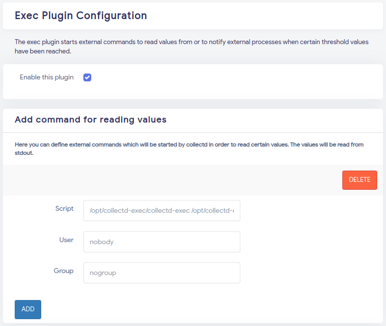

# all-in-one for collectd-exec-plugin

* output:
	* cpu frequency
	* check urls in a list
		* `Connect`: time for connection created (almost equal to TCP handshake time, 1 RTT)
		* `TTFB`: Time To First Byte
		* `DNS`: time for DNS lookup
		* `total`: total time for whole request
		* TODO: TLS handshake time

## for OpenWRT

* build the program:
	* build: `CGO_ENABLED=0 GOOS=linux GOARCH=amd64 go build -ldflags='-s -w'`
	* change `GOARCH` if you need
	* disable CGO (`CGO_ENABLED=0`) will be easier for libc compatibility issues (openwrt not use glibc as default)
	* copy output `collectd-exec` to anyway you want, eg: `/opt/collectd-exec/collectd-exec`
	* don't forgot execute permission
* `collectd-exec.json`:
	* url list for checking
	* put anyway you want, eg: `/opt/collectd-exec/collectd-exec.json`
* `exec.lua`
	* put in `/usr/lib/lua/luci/statistics/rrdtool/definitions/`
	* run as root: `rm -rf /tmp/luci-indexcache /tmp/luci-modulecache/`
	* more: [https://openwrt.org/docs/guide-user/perf_and_log/statistic.custom](https://openwrt.org/docs/guide-user/perf_and_log/statistic.custom)
* plugin-setup:
	* first argument is path to program, eg: `/opt/collectd-exec/collectd-exec`
	* second argument is path to config json, eg: `/opt/collectd-exec/collectd-exec.json`
	* `Script` will need to put in `/opt/collectd-exec/collectd-exec /opt/collectd-exec/collectd-exec.json`
	* 

